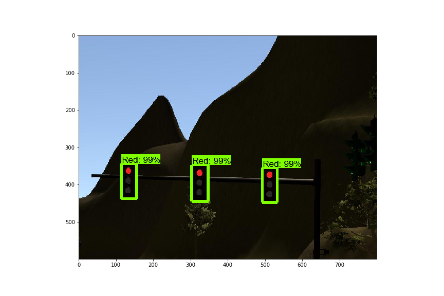
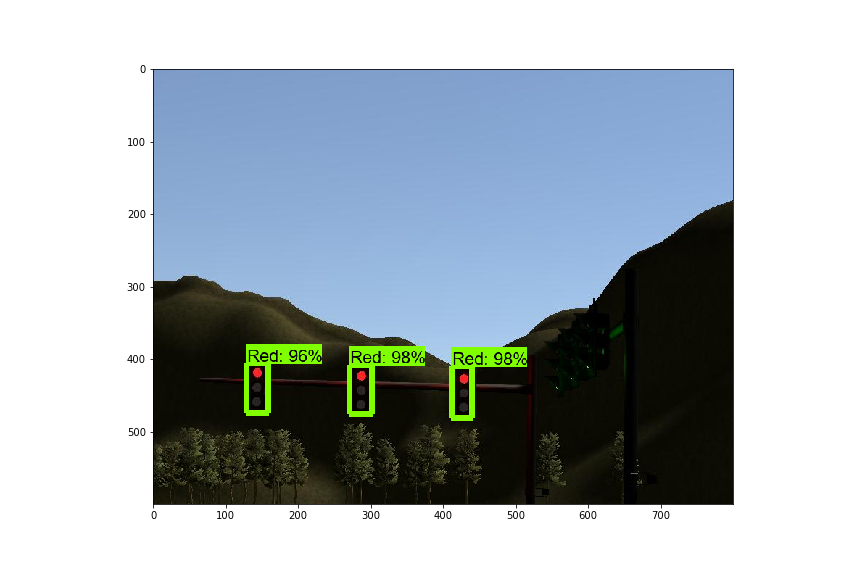
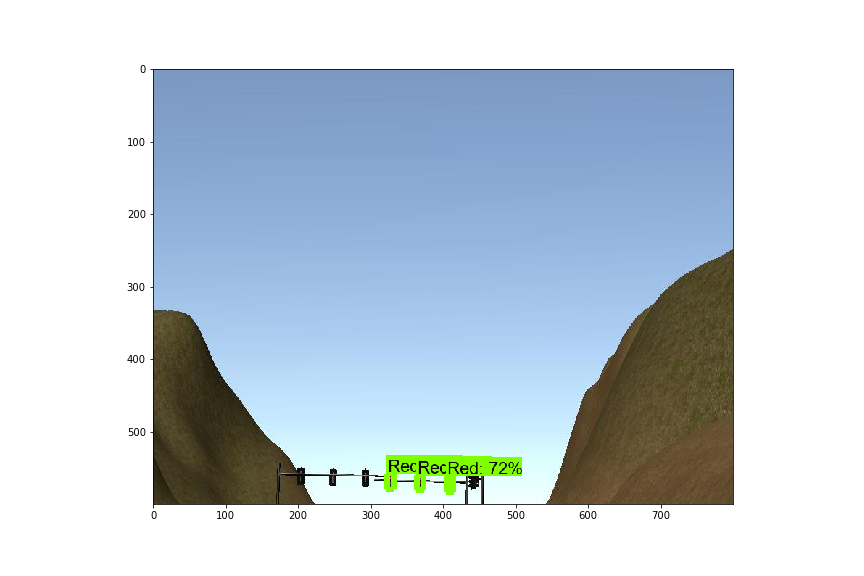
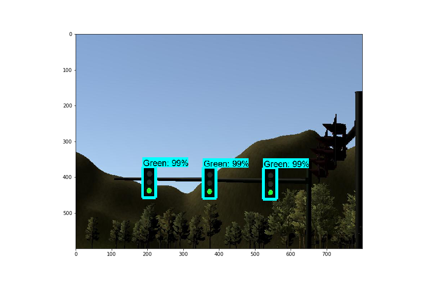
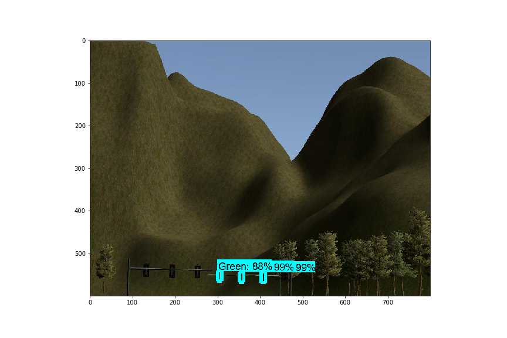
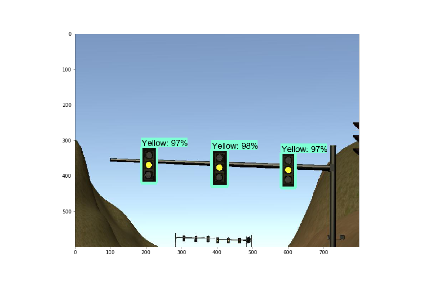

# Traffic light detection - CarND Capstone Project
Self-Driving Car Engineer Nanodegree Program, repo of traffic light detection, part of the [Capstone Project](https://github.com/udacity/CarND-Capstone).

## Introduction
This repo builds a traffic light detector of self-driving in simulator to appropriately detect and classify stop lights at intersections.

The steps:

  * Gather and label the datasets
  * Build transfer learning pipeline based on pre-trained TensorFlow models
  * Test the trained model to classify the state of traffic lights
  * Implement and integrate the trained model in project's ROS code

## Dependencies
The repo is based on tensorflow = 1.4.0 (still compatible with udacity's simulator which is running on tensorflow 1.3.0). TensorFlow object detection API installation tutorial can be found [here](https://tensorflow-object-detection-api-tutorial.readthedocs.io/en/tensorflow-1.14/) applicable for version 1.4.0

## Datasets
 I also write a helper function in ROS code to save the images in a local folder while driving. I then completed the datasets with I used the [datasets](https://www.dropbox.com/s/vaniv8eqna89r20/alex-lechner-udacity-traffic-light-dataset.zip?dl=0) provided by [Alex-lechner](https://github.com/alex-lechner/Traffic-Light-Classification).

Data labelling can be done with [labelImg](https://github.com/tzutalin/labelImg)

## Transfer learning pipeline
 The process can be summarized as following:
* Create labelmap file for objects to be classified
* Create tfrecord file based on datasets
* Update config file associated to fine tune the chosen pre-trained model according to model requirements
* Monitoring training process with tensorboard
* Frozen a graph from a given checkpoint
* Test model's performance

I trained on Google Colab the following pre-trained object detection models:

* [ssd_mobilenet_v1_coco_11_06_2017](http://download.tensorflow.org/models/object_detection/ssd_mobilenet_v1_coco_11_06_2017.tar.gz)
* [faster_rcnn_inception_v2_coco_2018_01_28](http://download.tensorflow.org/models/object_detection/faster_rcnn_inception_v2_coco_2018_01_28.tar.gz)

The faster_rcnn_inception_v2 model takes much longer to train and brings the very good accuracy/robustness but computationally more expensive.
ssd_mobilenet_v1 is fast to train but less accurate and robust than faster_rcnn_inception_v2. But both trained models can detect correctly the traffic lights in simulator for most of the time. 

## Test model performance
Sample results of the trained ssd_mobilenet_v1:

